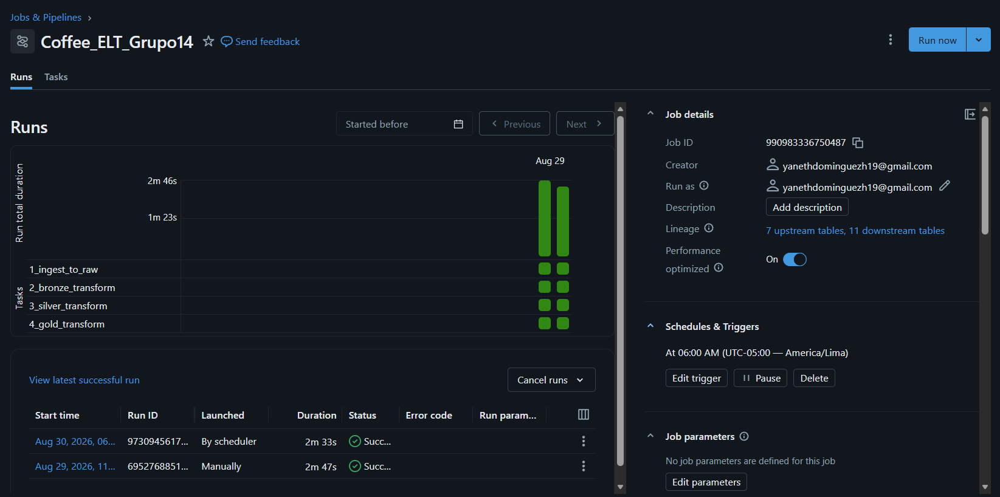
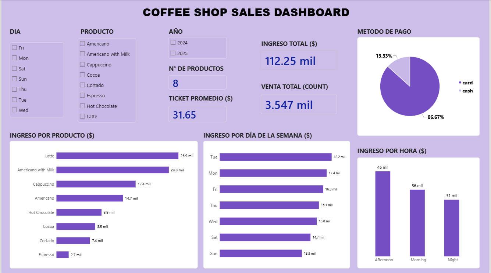
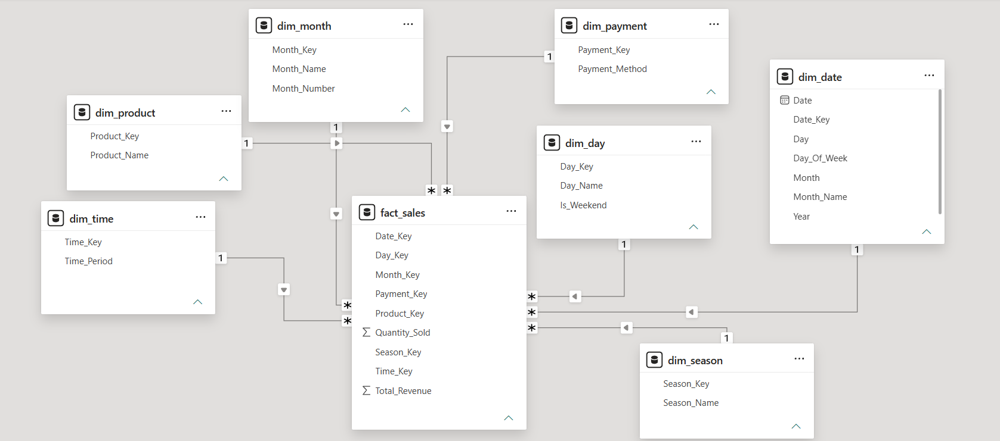

# Proyecto ELT - Grupo 14
## Coffee Shop Sales Pipeline

---

### 👥 Realizado por:
- Dominguez Huacho Yaneth Marilu

---

## 1. Fuente de Datos

**Dataset:** Coffee Shop Sales (Kaggle)
- **Formato:** CSV
- **Registros:** 3,547 transacciones
- **Período:** Marzo 2024 - Marzo 2025
- **Columnas:** hora, producto, monto, fecha, método de pago.
- **Descripción:** Ventas de una cafeteria con información de productos, horarios y métodos de pago.

---

## 2. Arquitectura Medallón

| Capa | Transformación | Tabla |
|------|----------------|-------|
| **RAW** | Datos originales | `capa_raw.coffee_sales_raw` |
| **Bronze** | Estandarización + IDs numéricos | `capa_bronze.coffee_sales_bronze` |
| **Silver** | Limpieza + enriquecimiento | `capa_silver.coffee_sales_silver` |
| **Gold** | Modelo Estrella (7 dims + 1 hecho) | `capa_gold.coffee_sales_gold` |

**Dimensiones:** Producto, Fecha, Hora, Día, Mes, Temporada, Pago  
**Hechos:** Ventas (ingresos, cantidad)

---

## 3. Orquestación con Databricks Jobs

**Job:** `Coffee_ELT_Grupo14`

| Tarea | Notebook | Depende de |
|-------|----------|------------|
| 1 | `1_ingest_to_raw` | - |
| 2 | `2_bronze_transform` | Tarea 1 |
| 3 | `3_silver_transform` | Tarea 2 |
| 4 | `4_gold_transform` | Tarea 3 |

**Schedule:** Todos los días a las 6:00 AM

---

## 4. Dashboard en Power BI

### KPIs
| Indicador | Valor |
|-----------|-------|
| Ingreso Total | $112.25 mil |
| Ventas Totales | 3,547 |
| Ticket Promedio | $31.65 |
| Productos | 8 |

### Visualizaciones
1. Ingreso por Producto
2. Ingreso por Día de Semana
3. Ingreso por Hora
4. Método de Pago (Card vs Cash)

**Filtros:** Producto, Día, Año

**Modelo Estrella**

### Preguntas de Negocio
| Pregunta | Respuesta |
|----------|-----------|
| Café más vendido | Latte ($26.9K) |
| Día con más ventas | Martes ($18.2K) |
| Hora con más ventas | Tarde ($46K) |
| Método de pago preferido | Tarjeta (86.7%) |

---

## 5. Cómo Ejecutar

### Requisitos
- Cuenta en Databricks (Community Edition)
- Power BI Desktop

### Paso 1: Subir el CSV
1. **Catalog** → **Create Table** → **Upload File**
2. Sube `Coffe_sales.csv`
3. Nombre: `coffee_sales_raw`

### Paso 2: Ejecutar notebooks
Ejecuta en este orden:

| Orden | Notebook | Ruta |
|-------|----------|------|
| 1 | `1_ingest_to_raw` | `notebooks/01_raw/` |
| 2 | `2_bronze_transform` | `notebooks/02_bronze/` |
| 3 | `3_silver_transform` | `notebooks/03_silver/` |
| 4 | `4_gold_transform` | `notebooks/04_gold/` |

### Paso 3: Crear el Job
1. **Workflows** → **Jobs** → **Create Job**
2. Agrega las 4 tareas en orden
3. Programa: Daily a las 6:00 AM

### Paso 4: Conectar Power BI
1. Copia Server Hostname y HTTP Path desde **SQL Warehouses**
2. Genera un token en **Settings** → **Developer** → **Access Tokens**
3. En Power BI: **Obtener datos** → **Databricks**
4. Selecciona las tablas del modelo estrella

---

## 6. Tecnologías

- **Databricks** - Procesamiento y orquestación
- **PySpark** - Transformación de datos
- **Delta Lake** - Almacenamiento por capas
- **Power BI** - Dashboard y visualización
- **Git/GitHub** - Control de versiones

---
